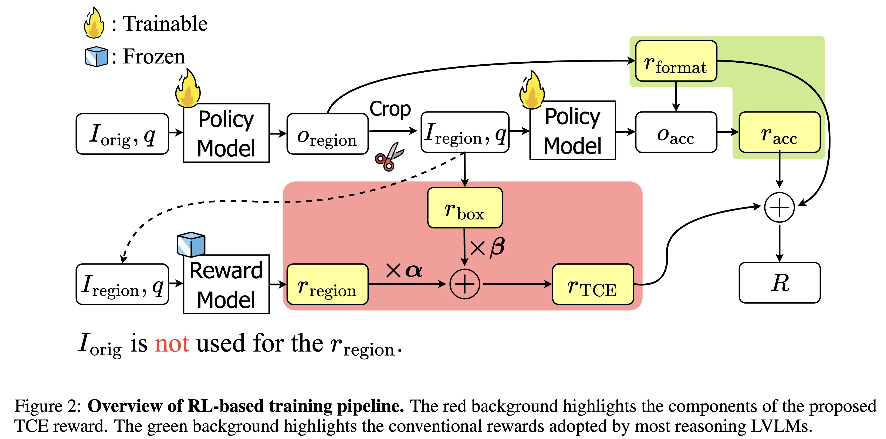

# ERGO: Efficient High-Resolution Visual Understanding for Vision-Language Models

<p align="center">
  <a href="https://arxiv.org/abs/2509.21991">
    </a>
  <a href="https://github.com/nota-github/ERGO.git">
    </a>
  <a href="https://huggingface.co/nota-ai/ERGO-7B">
    </a>
</p>

ERGO (Efficient Reasoning & Guided Observation) is a large vision–language model trained with reinforcement learning on efficiency objectives, focusing on task-relevant regions to enhance accuracy and achieve up to a 3× speedup in inference.





## Installation
> `Python >= 3.10 is required.`

```bash
curl -LsSf https://astral.sh/uv/install.sh | sh
git clone https://github.com/nota-github/ERGO.git
cd ERGO
uv venv
uv sync
source .venv/bin/activate
uv pip install -e .
```

## Usage
> We recommend using vLLM, as its `Automatic Prefix Caching` can significantly improve inference speed.

This repository provides evaluation scripts for the following benchmarks:
- [V* Bench](https://huggingface.co/datasets/craigwu/vstar_bench)
- [HR-Bench](https://huggingface.co/datasets/DreamMr/HR-Bench)
- [MME-RealWorld-lite](https://huggingface.co/datasets/yifanzhang114/MME-RealWorld-lite-lmms-eval)

See [`data/README.md`](data/README.md) for how to prepare datasets


### Evaluation with vLLM

1. Serving with vLLM

```bash
bash ./scripts/run_vllm.sh
```

2. Run eval.py

```bash
export MAX_VISION_TOKEN_NUM=1280
export VLLM_ENDPOINT=http://127.0.0.1:8008/v1
export DATA_ROOT=./data

python ./src/ergo/eval.py \
    --dataset {choose from [vstar, mmerwl, hrbench]} \
    --data_root $DATA_ROOT\
    --api_url $VLLM_ENDPOINT \
    --max_vision_token_num $MAX_VISION_TOKEN_NUM
```

### Inference with Hugging Face

```bash
python ./src/ergo/infer.py \
    --input_path {default = "./data/demo/demo.jpg"} \
    --question {default = "Is the orange luggage on the left or right side of the purple umbrella?"} \
    {--save_output} # optional
```

## License

This project is released under [Apache 2.0 licence](LICENSE).

## Acknowledgements
- We would like to express our sincere appreciation to the following projects:
  - [Qwen2.5-VL](https://github.com/QwenLM/Qwen3-VL): The base model we utilized. They are originally licensed under Apache 2.0 License.
  - [VLM-R1](https://github.com/om-ai-lab/VLM-R1): The RL codebase we utilized. It is originally licensed under Apache 2.0 License.
  - [V*](https://github.com/penghao-wu/vstar), [HR-Bench](https://github.com/DreamMr/HR-Bench), [MME-RealWorld-lite](https://github.com/MME-Benchmarks/MME-RealWorld) : The evaluation benchmark dataset we utilized.

- We also deeply appreciate the generous GPU resource support from [Gwangju AICA](http://www.aica-gj.kr/main.php).

## Citation
```bibtex
@misc{lee2025ergoefficienthighresolutionvisual,
      title={ERGO: Efficient High-Resolution Visual Understanding for Vision-Language Models}, 
      author={Jewon Lee and Wooksu Shin and Seungmin Yang and Ki-Ung Song and DongUk Lim and Jaeyeon Kim and Tae-Ho Kim and Bo-Kyeong Kim},
      year={2025},
      eprint={2509.21991},
      archivePrefix={arXiv},
      primaryClass={cs.CV},
      url={https://arxiv.org/abs/2509.21991}, 
}
```
